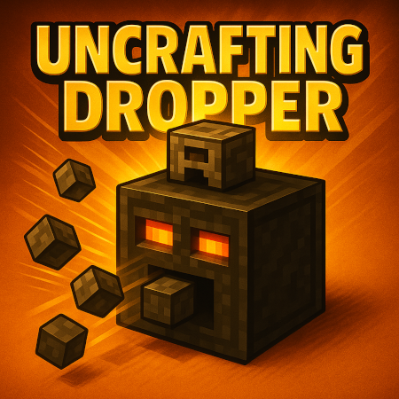

Uncrafting Dropper:

The Uncrafting Dropper is a utility block that allows players to reverse-craft items into their components. 
Simply place an item in the dropper, and it will attempt to break it down into its crafting ingredients.

Features:

   Reverse Crafting: Automatically disassembles items into their crafting components.
   Damaged Item Support: Properly handles items with durability, ensuring correct behavior for tools and weapons.
   Redstone Integration: Can be toggled with redstone signals for automation.
   Item Dispensing: Outputs components into the world or connected inventory.
   Enchantments Extraction: Converts enchantments into books with a configurable drop probability.
